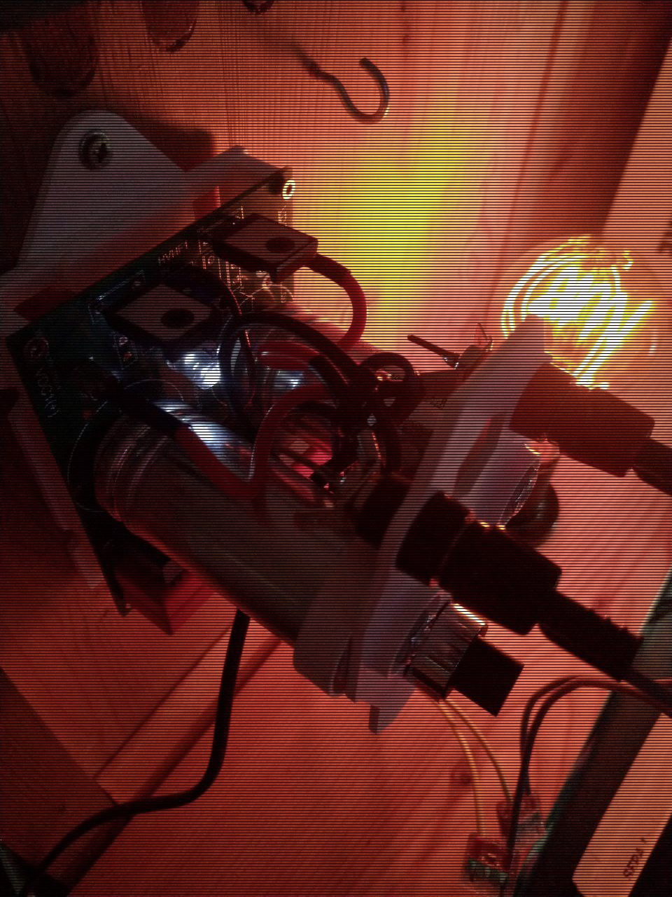

# Overunity

Overunity is a dark Omarchy theme inspired by field notebooks, resonance experiments, tungsten light, and analog instrumentation. It combines a near-black work surface with tungsten amber, blue-green circuit detail, and high-contrast developer-friendly colors.



## Install

```bash
omarchy theme install https://github.com/ariDev1/overunity
omarchy theme set overunity
```

## Included

- Dark color palette for Omarchy-supported applications
- `Yaru-yellow-dark` folder icons
- Original Overunity background collection with subtle CCTV scanlines

## Optional Extras

The bar telemetry, workspace channels, menu, lock screen, terminal prompt, and daily wallpaper timer are documented separately in [overunity-extras](https://github.com/ariDev1/overunity-extras).

## License

MIT. The included visual material is released by its contributor for use with this theme.
